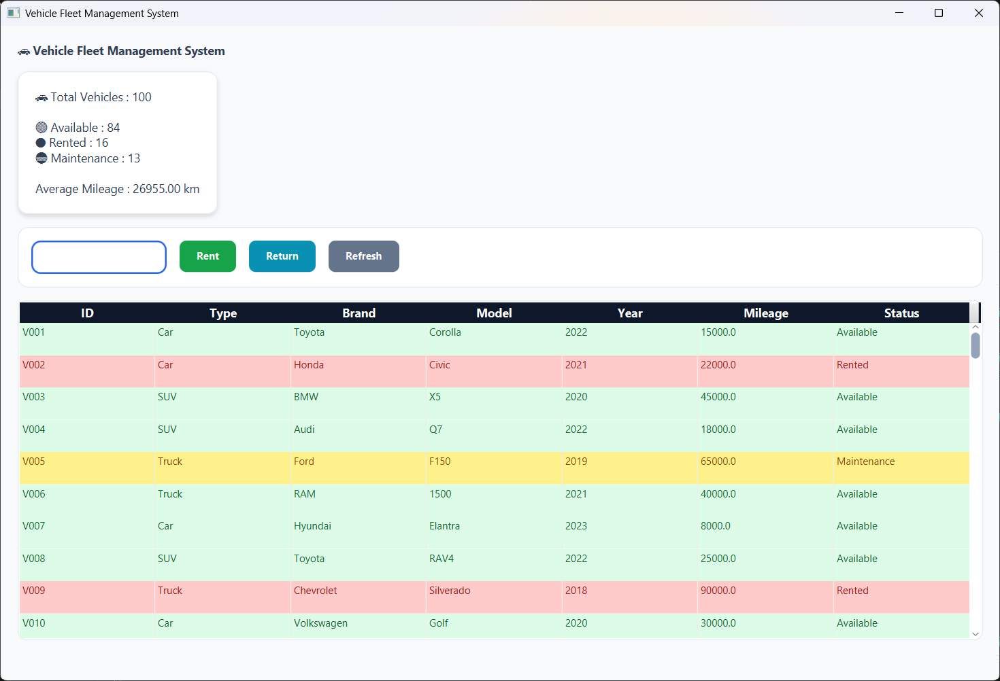

# 🚗 Vehicle Fleet Management System

## 📋 Project Overview

The **Vehicle Fleet Management System** is a Java 17 application designed to manage a rental vehicle fleet.

The application combines advanced **Object-Oriented Programming concepts** with a modern **JavaFX graphical interface** to provide an efficient fleet management solution.

The system allows users to:

- Load vehicle data from CSV files
- Manage vehicle rentals and returns
- Track vehicle maintenance status
- Generate fleet statistics
- Produce fleet reports
- Visualize and interact with vehicles through a professional graphical interface


This project was developed as part of the **UA3 – Advanced Object-Oriented Programming** assignment.

---

# 🎯 Objectives

The main objective of this project is to apply advanced Java programming concepts:

- Object-Oriented Programming (OOP)
- Inheritance
- Abstract classes
- Interfaces
- Polymorphism
- Encapsulation
- Method overriding
- Collections (ArrayList)
- Custom exceptions
- File management
- CSV processing
- Report generation
- SOLID principles
- JavaFX graphical interface development

---

# 📁 Project Structure

```text
UA3_Vehicle_Fleet_Management_System
│
├── src
│   │
│   ├── app
│   │   ├── Main.java
│   │   └── FleetApplication.java
│   │
│   ├── controller
│   │   └── VehicleController.java
│   │
│   ├── model
│   │   ├── Vehicle.java
│   │   ├── Car.java
│   │   ├── SUV.java
│   │   └── Truck.java
│   │
│   ├── interfaces
│   │   ├── Rentable.java
│   │   └── Maintainable.java
│   │
│   ├── service
│   │   ├── FleetManager.java
│   │   ├── RentalManager.java
│   │   ├── MaintenanceManager.java
│   │   ├── StatisticsManager.java
│   │   ├── CsvManager.java
│   │   └── ReportManager.java
│   │
│   ├── exceptions
│   │   ├── VehicleNotAvailableException.java
│   │   └── InvalidMileageException.java
│   │
│   └── resources
│       └── style.css
│
├── data
│   └── vehicles.csv
│
├── reports
│   └── fleet_report.txt
│
├── README.md
├── .gitignore
└── LICENSE
```

---

# 🚀 Features

## 🚗 Vehicle Management

The system supports different vehicle types:

- Car
- SUV
- Truck


Vehicle hierarchy:

```text
              Vehicle
                 |
      -----------------------
      |          |          |
     Car        SUV       Truck
```


Each vehicle contains:

- Vehicle ID
- Vehicle type
- Brand
- Model
- Manufacturing year
- Mileage
- Rental availability status

---

# 🚘 Rental Management

The rental module provides:

- Rent a vehicle
- Return a vehicle
- Check vehicle availability
- Calculate rental costs


Rental cost calculation uses polymorphism:

```java
calculateRentalCost(int days)
```


## Rental Rules

- A rented vehicle cannot be rented again.
- A vehicle requiring maintenance can still be rented.
- Maintenance status is displayed independently from rental status.

---

# 🛠 Maintenance Management

The application automatically detects vehicles requiring maintenance.


Example rule:

```text
Mileage > 50000 km

        ↓

Maintenance required
```


Maintenance features:

- Detect vehicles requiring maintenance
- Display maintenance status
- Generate maintenance statistics

---

# 📂 CSV Data Management

Vehicle data is loaded from:

```text
data/vehicles.csv
```


The CSV module provides:

- CSV file reading
- Vehicle object creation
- Data validation
- Invalid record detection
- Exception handling


Example CSV format:

```csv
id,type,brand,model,year,mileage,rented,extra

V001,Car,Toyota,Corolla,2022,15000,false,4

V002,SUV,BMW,X5,2021,35000,false,true

V003,Truck,Ford,F150,2020,70000,true,2.5
```

---

# 🖥 JavaFX Graphical Interface

The project includes a professional JavaFX interface.

---

# 📸 Application Screenshot

The following screenshot shows the JavaFX graphical interface of the Vehicle Fleet Management System:



---

## Main Features

The graphical application provides:

✅ Vehicle table visualization  
✅ Dynamic search  
✅ Vehicle rental  
✅ Vehicle return  
✅ Refresh function  
✅ Vehicle details dialog  
✅ Fleet dashboard  
✅ Professional CSS theme  


---

# 🎨 Professional UI Theme

The interface uses a custom CSS theme with:

- Modern colors
- Styled buttons
- Dashboard card design
- Professional table
- Status-based vehicle colors


Vehicle status colors:


| Status | Color |
|---|---|
| Available | 🟢 Green |
| Rented | 🔴 Red |
| Maintenance | 🟡 Yellow |


Example:

```text
Toyota Corolla     🟢 Available

Honda Civic        🔴 Rented

BMW X5             🟡 Maintenance
```

---

# 📊 Dashboard Statistics

The dashboard displays:

- Total number of vehicles
- Available vehicles
- Rented vehicles
- Vehicles requiring maintenance
- Average mileage


Example:

```text
Total Vehicles : 15

Available : 10

Rented : 3

Maintenance : 2

Average Mileage : 32450 km
```

---

# 📄 Report Generation

The application generates a TXT report:

```text
reports/fleet_report.txt
```


The report contains:

- Fleet summary
- Vehicle statistics
- Rental information
- Maintenance information

---

# 🏗 Application Architecture

The application follows a layered architecture:


```text
+----------------------+
| JavaFX Interface     |
+----------------------+
           |
           v
+----------------------+
| VehicleController    |
+----------------------+
           |
           v
+----------------------+
| Service Layer        |
+----------------------+
           |
           v
+----------------------+
| Model Layer          |
+----------------------+
           |
           v
+----------------------+
| CSV Data             |
+----------------------+
```

---

# 🏗 SOLID Principles Applied

## Single Responsibility Principle (SRP)

Each class has a specific responsibility:


| Class | Responsibility |
|---|---|
| FleetManager | Manage fleet vehicles |
| RentalManager | Manage rentals |
| MaintenanceManager | Manage maintenance |
| CsvManager | Load CSV data |
| StatisticsManager | Calculate statistics |
| ReportManager | Generate reports |


---

## Open/Closed Principle (OCP)

The system allows adding new vehicle types without modifying existing classes.


Example:

```java
public class Motorcycle extends Vehicle
```


Existing services continue working without modification.

---

# 🛠 Technologies Used

- Java 17
- JavaFX 17
- CSS Styling
- Object-Oriented Programming
- ArrayList Collections
- File I/O
- CSV Processing
- Exception Handling
- Git
- GitHub

---

# ▶️ Run Console Application

Compile:

```bash
javac -d bin src/interfaces/*.java src/model/*.java src/exceptions/*.java src/service/*.java src/app/Main.java
```


Run:

```bash
java -cp bin app.Main
```

---

# ▶️ Run JavaFX Application

JavaFX SDK 17 is required.


Compile:

```bash
javac --module-path PATH_TO_JAVAFX/lib --add-modules javafx.controls -d bin src/**/*.java
```


Run:

```bash
java --module-path PATH_TO_JAVAFX/lib --add-modules javafx.controls -cp bin app.FleetApplication
```

---

# 📌 Future Improvements

Possible enhancements:

- Add/Edit/Delete vehicle interface
- Database integration
- User authentication
- Rental history tracking
- PDF report export
- Advanced dashboard charts
- User roles management


---

# 📜 License

This project is developed for educational purposes.